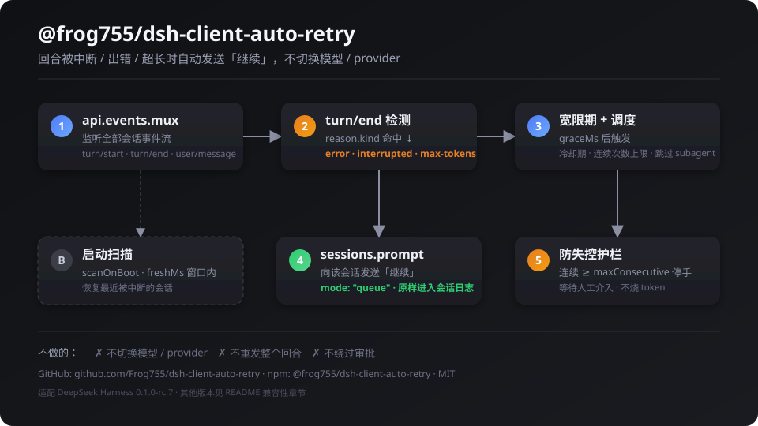
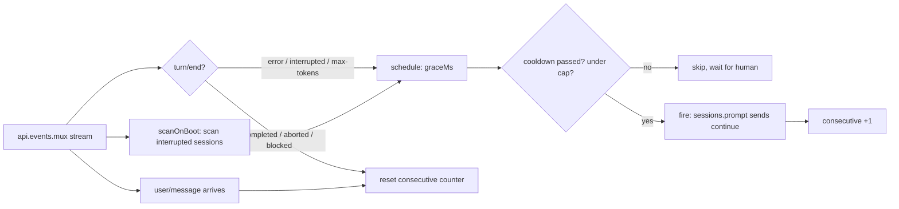

# @frog755/dsh-client-auto-retry

> A DeepSeek Harness (DSH) **client plugin** that detects interrupted / errored /
> overlong (`max-tokens`) turns and automatically sends a "继续 / continue" prompt
> to resume them. It only retries — it does **not** switch models or providers.
> Ships with a settings card.

中文版: [README.md](./README.md)

<p align="center">
  
</p>

---

## What it does

DSH turns occasionally get interrupted by network flakiness, provider errors,
timeouts, or hitting the output token ceiling. In most cases the model has already
done most of the work — sending one more "continue" prompt lets it finish, with no
human intervention and no model switch.

This plugin:

1. Listens to the session event stream (`api.events.mux`);
2. When a `turn/end` arrives with `reason.kind ∈ { error, interrupted, max-tokens }`,
   waits a grace period (default 5s, giving the host time to reconnect/recover);
3. Auto-sends "继续" (configurable text) to that session;
4. Has guards: cooldown, max consecutive attempts, and boot-time scanning of
   recently interrupted sessions.

## Install

### A. From npm (recommended)

Inside your DSH profile directory (e.g. `~/.dsh/profiles/web`):

```powershell
pnpm add @frog755/dsh-client-auto-retry
```

Then add `@frog755/dsh-client-auto-retry` to `dsh.profile.bundles` in the profile's
`package.json` (the package ships a `cordis.patch.yml` that inserts the
`auto-retry` row into the plugin roster as a bundle layer):

```jsonc
{
  "dependencies": {
    "@frog755/dsh-client-auto-retry": "^0.3.0"
  },
  "dsh": {
    "profile": {
      "bundles": [
        "@deepseek-ai/dsh-base",
        "@deepseek-ai/dsh-web-app",
        // ... other bundles ...
        "@frog755/dsh-client-auto-retry"
      ]
    }
  }
}
```

Then:

```powershell
pnpm install
```

**Restart DeepSeek Harness** (host-side plugins load only once per process), then
refresh the browser page.

### B. Local link for development

```jsonc
{
  "dependencies": {
    "@frog755/dsh-client-auto-retry": "link:C:/Users/frog/.dsh/projects/dsh-client-auto-retry"
  }
}
```

Client changes under `lib/` apply on page refresh; host changes (`lib/index.js`)
need a restart.

## Settings

Settings entry: **Settings → General → Auto Retry**. All fields apply live
(`applies: "live"`).

| Field | Default | Meaning |
| --- | --- | --- |
| `graceMs` | `5000` | How long to wait after an interruption before auto-sending "continue" (ms) |
| `cooldownMs` | `20000` | Minimum interval between two auto-continues for the same session |
| `maxConsecutive` | `5` | Stop auto-retrying after this many consecutive attempts; wait for a human |
| `continueText` | `继续` | The text to send |
| `scanOnBoot` | `true` | Scan recently interrupted sessions on page load and resume them |
| `freshMs` | `900000` | Scan window: only sessions touched within this many ms |
| `verbose` | `true` | Print `[auto-retry]` debug logs to the browser console |

## How it works



All core logic lives in `AutoRetryRunner` in `lib/client.js`; `lib/index.js` (the
host half) only registers the settings schema.

## Compatibility notes (important)

> 📖 Full version: [docs/COMPATIBILITY.md](docs/COMPATIBILITY.md) (with a debugging checklist and an index of modification points).

### Tested version

This plugin was written and verified against **DSH `0.1.0-rc.7`** (web profile;
the desktop runtime ships the same rc.7 here). **Different DSH versions and
form-factors (desktop app, newer/older release candidates, community builds) may
have different interfaces — if it does not install or does not fire, check the
table below item by item.**

### DSH API surface this plugin depends on

| # | Dependency | Shape in rc.7 | Possible changes elsewhere |
| --- | --- | --- | --- |
| 1 | Opening the event stream | `api.events.mux({}, signal)` → `AsyncIterable<RpcRequest<MuxFrame>>` | method name, args, return type |
| 2 | Mux frame envelope | Frames are RPC envelopes `{ rpcId, payload }`; the content lives in `payload` (`session/event`, …) | Some builds push raw frames `{ type, sessionId, event }`; the plugin already accepts both (see `onMuxFrame`) |
| 3 | Turn-end reason | `turn/end` `data.reason.kind ∈ { completed, aborted, blocked, error, 'max-tokens', interrupted }` | Enum names may grow/shrink; `TurnEndReasonMap` is designed to be plugin-merged |
| 4 | Sending continue | `api.sessions.prompt({ sessionId, mode: 'queue', content: [{ type: 'text', text }] })` → `{ result: { ok } }` | request/response shape may change |
| 5 | Session list | `api.sessions.list({})` → `result.value` (or `result.data`) array; fields `s.id`/`s.sessionId`, `s.updatedAt`/`s.lastActivityAt` | field names may change (plugin reads both) |
| 6 | Client module format | `window.__ModuleLoader__.load({ id, factory })` (`@deepseek-ai/dsh-client-runtime`) | desktop or other builds may use a different loader |
| 7 | Settings schema (host) | `settingsNamespace(NS)` + `ctx.settings.register(ns, schema, { applies: 'live' })` (`@deepseek-ai/dsh-settings`) | registration API or `applies` values may change |
| 8 | Settings card (client) | `ctx.slots.inject('settings.general.item')` + `slots.register(...)` + `ctx.locale.register(NS, { zh, en })` + `ctx.settingsScope.bind({ namespace: NS })` + `runtime.defineStore(...)` | slot id, locale/scope/store APIs may change |
| 9 | Bundle mechanism | `dsh.bundle.patch` in `package.json` → `cordis.patch.yml` with `- insert: { id, name }` | older versions may need a manual `insert` in the profile's `cordis.patch.yml`, or a totally different mechanism |

### Debugging checklist

1. Open DevTools console and look for `[auto-retry]` logs (`verbose` is on by default).
2. Plugin row not loading at all: confirm `dsh.profile.bundles` includes
   `dsh-client-auto-retry` and DSH was restarted.
3. Loaded but never fires: call `api.events.mux({}, signal)` manually in the
   console and inspect the frame shape — compare with rows #2/#3 above.
4. Fires but send fails: check `sessions.prompt` / `sessions.list` request-response
   shapes (rows #4/#5).
5. No settings card: check settings/slots registration (rows #7/#8).

### Common pitfalls

- **Host-side changes need a DSH restart** — `lib/index.js` changes won't apply on
  refresh alone.
- **Don't set `maxConsecutive` too high** — if the provider keeps failing, retries
  just burn tokens; keep the default ≤ 5 and let the plugin stop for human input.
- **`scanOnBoot` only touches sessions within `freshMs`** — stale sessions won't be
  poked after a long downtime.
- **It is not an error fallback** — it only sends "continue", it does not switch
  models/providers; configure failover in DSH's model routing if you need it.

## Development

```powershell
# Plain ESM, no build step — edit and reload
# Client: refresh the page
# Host: restart DSH
```

Log prefix: `[auto-retry]`. Set `verbose: false` to silence non-critical logs
(connection logs still print).

## Acknowledgements

Development and daily testing of this plugin used free model credits from
Alibaba Cloud Bailian (student-verified accounts receive ¥300 credit, covering
most mainstream domestic models):

<https://university.aliyun.com/course/promotion27-activity?clubTaskBiz=subTask..12810055..10280..&userCode=hbs5sljx>

## License

MIT
